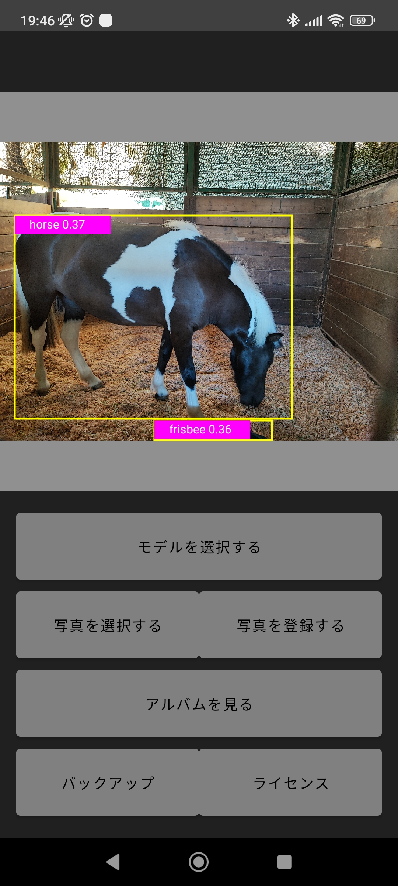
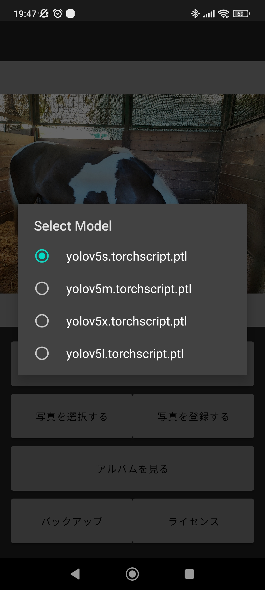
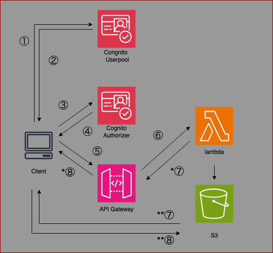
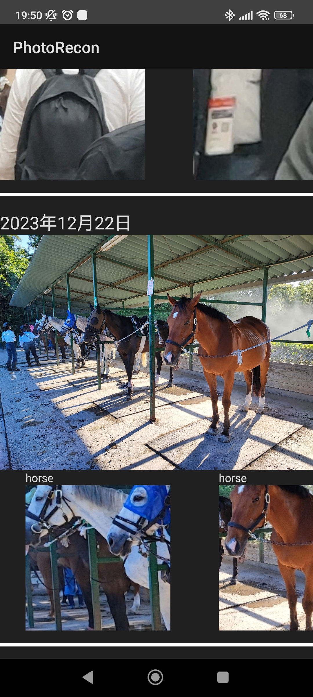
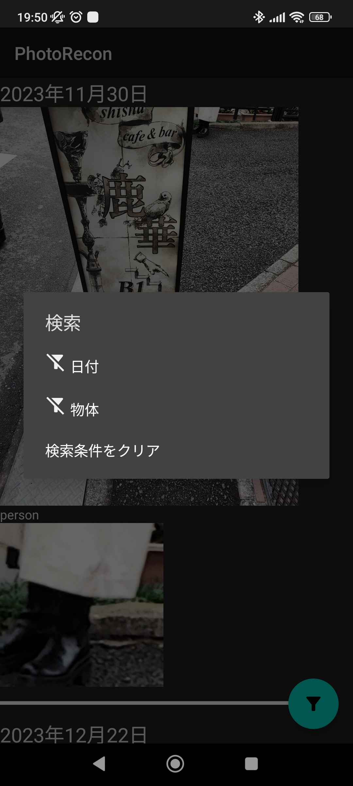
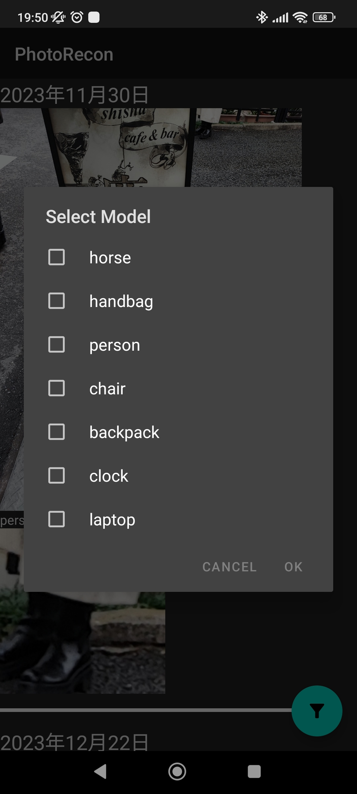

# PhotoRecon

このアプリケーションはpytorch mobileを手軽に試すことを目的とした，android アプリケーションです．

yoloによってセグメンテーションした領域を切り抜いて新たな写真として保存します．

元のコードに関しては，referencesを参照してください．

## 動作環境
android sdk version > 34

## 詳細

### main

- 「モデルを選択する」から，yoloのサイズを変更できます．
- 「写真を選択する」から端末内の写真をアプリに取り込むことができます．取り込んだ写真は自動的に推論が実行されます．
- 「写真を登録する」から推論した写真をアルバム内に保存することができます．写真はIDとしてローカルに保存され，IDはrealmDBのよって管理されます．
- 「アルバムを見る」からalbum画面へ遷移できます．
- 「バックアップ」からbackup画面へ遷移できます．具体的には，AWS Cognito認証を使用したアルバム情報のバックアップが実行できます．
- 「ライセンス」からアプリで使用されているライブラリ，またその関連ライセンスについて表示する画面へ遷移します．
### license
ライセンス一覧を表示します．
 com.google.gms:oss-licenses を使用したものと，そのほかライセンスを表示します．

### global/backup[WIP]

AWS Cognito認証・認可を使用してS3にrealmのバックアップを実行します．

#### フロント
メールアドレス，パスワードを使用して，ユーザ登録ができます．
非同期処理が頻発するため，Viewmodelを使用して，フロントへイベントを通達しています．
#### サーバ

- ①，②，③，④でcognito認証・認可を実行します．
- ⑤にてcongnitoのトークンを使用してAPIgatewayの認証を通し，⑥にてlambdaを起動します．
- ⑦，⑧経由でメールアドレスをハッシュ化した識別情報から，ユーザごとに分割したS3バケットに対して，S3get等の情報をレスポンスとして戻します．
 *リクエストがrealmDBのアップロード/ダウンロードの場合
- ⑨にて，短期間有効な署名付きURLを発行します．このアップロード/ダウンロードはAPIgatewayを通過しません．

### album
realmDBとGlideを使用した速い読み出しを実装しています．また，検索機能も有し，日付の期間(wip)，識別した物体の種別ごとをキーとして検索できます．

## 参照
本コードは下記を参考にしています．
https://github.com/pytorch/android-demo-app/tree/master/ObjectDetection

## 執筆記事
- https://qiita.com/sanjolin_chun/items/f667adf5ad75ed47c9bd
- https://qiita.com/sanjolin_chun/items/090ff55c748f003a54a7
- https://qiita.com/sanjolin_chun/items/7c2289fa849a9b5d7337

